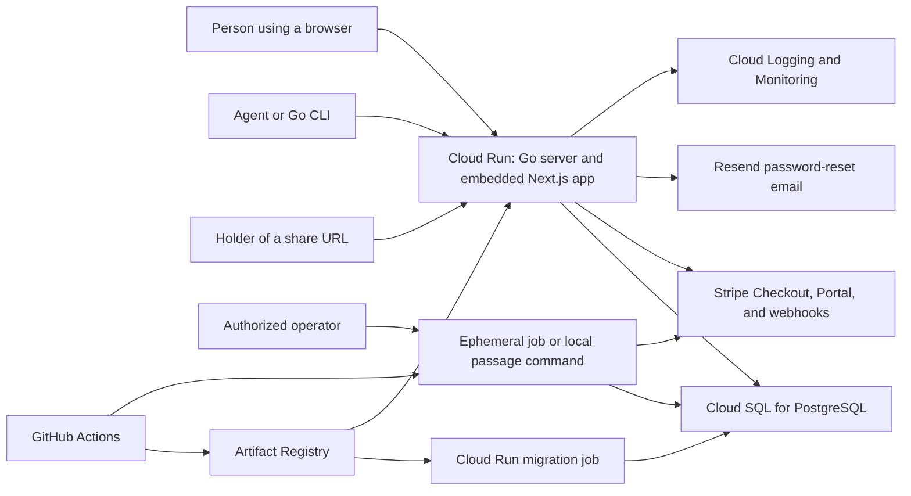

# passage.md architecture

> **Status:** Current implementation
>
> **Verification basis:** Working tree based on `be630e2`

## 1. Executive summary

Passage is a hosted Markdown workspace for people and agents.

A statically exported Next.js app and a Go HTTP API ship in one container and run from one Cloud Run service.

The Go process serves both surfaces from one origin and stores server-backed state in PostgreSQL.

Cloud SQL is the production database.

Stripe supplies billing, Resend supplies password-reset email, and a separate Go CLI uses the public document API.

The main rule is that the browser is never the authority for identity, document ownership, sharing, quotas, or paid access.

Those rules are enforced by the Go server and PostgreSQL queries.

## 2. System context



The browser, CLI, agents, public share readers, Stripe, and Resend are outside the application trust boundary.

The Cloud Run service, migration job, and ephemeral production operation jobs run as separate Google Cloud resources with separate duties.

## 3. Architectural invariants

1. Saved documents and templates belong to one user and are filtered by that owner in PostgreSQL.
2. Saved documents are private until their owner explicitly creates a public share.
3. Cross-user document access returns `404` so the server does not reveal that a private document exists.
4. Browser clients use an opaque server-backed session cookie.
5. CLI and agent clients use bearer API tokens, and bearer access to documents requires Pro entitlement.
6. Sharing, API-token creation, document quotas, billing, and administrative access are enforced on the server.
7. Markdown remains plain text in storage.
8. Public HTML is rendered from stored Markdown and sanitized before it is returned.
9. Application startup never runs schema migrations.
10. Production migrations finish before a new application revision receives traffic.
11. Database recovery mode rejects every HTTP mutation and disables background writes.

## 4. Components and dependencies

### Web app

`apps/web` owns the browser interface, editor state, Markdown preview, templates interface, account screens, and calls to the JSON API.

It depends on the same-origin Go API for authenticated state and persistence.

It does not own authentication, authorization, billing truth, quotas, or public sharing policy.

The Next.js build uses static export.

The generated files are copied into the Go package and embedded in the server binary.

### HTTP composition layer

`server/internal/server` owns route registration and cross-cutting request policy.

It connects authentication, documents, templates, billing, community access, rate limits, static files, and operational fences.

It depends on the domain packages below.

It does not own their database queries or core validation rules.

### Authentication

`server/internal/auth` owns users, password credentials, server sessions, API tokens, and password-reset requests.

Passwords use bcrypt.

Session and API-token secrets are stored as hashes.

Password-reset delivery is queued in PostgreSQL and processed by a background worker.

The package depends on PostgreSQL and, when configured, Resend.

It does not decide document access or plan entitlement.

### Documents and public sharing

`server/internal/documents` owns document validation, persistence, owner-scoped queries, pagination, full-text search, archiving, share state, public Markdown, and public HTML rendering.

It depends on authenticated user identity supplied by the server composition layer and on PostgreSQL.

It does not decide a user's plan or saved-document allowance.

### Templates

`server/internal/templates` owns private Markdown templates, their descriptions, validation, ownership, and the ten-template limit.

It depends on session-authenticated user identity and PostgreSQL.

It does not create documents itself or expose templates through the public document API.

### Billing and entitlements

`server/internal/billing` owns the effective Free or Pro account state, per-account document-limit overrides, Stripe customer linkage, subscription state, and Stripe client behavior.

It depends on PostgreSQL and Stripe.

The server composition layer asks it for an account before enforcing paid operations or document creation limits.

It does not own document records or browser presentation.

### Community and administration

`server/internal/community` owns reusable referral records and community Pro grants.

Administrative handlers expose account, referral, and grant operations only to session users in the configured owner-email list.

The list defaults to `owain@owainlewis.com` when `PASSAGE_OWNER_EMAILS` is unset.

This boundary does not grant broad database or Google Cloud access.

### Database and migrations

`server/internal/database` owns the bounded PostgreSQL connection pool.

`server/internal/migrations` owns ordered forward-only SQL migrations and serializes migration execution with a PostgreSQL advisory lock.

Domain packages own their own queries.

No general repository layer sits between them and PostgreSQL.

### Operator command surface

The `passage` server binary also exposes privileged commands for migrations, user creation, account export, permanent account deletion, Stripe-customer cleanup, and community referral or grant changes.

These commands depend directly on PostgreSQL and sometimes Stripe.

`server/internal/accountdata` owns account export, deletion, and deferred Stripe-cleanup records.

Production community mutations run the exact deployed image as a short-lived Cloud Run job after repository scripts verify the serving revision and operation inputs.

These commands are an operator trust boundary.

They are not public product APIs and do not share the public CLI's bearer-token restrictions.

### Public CLI

The public Go CLI lives in the separate `owainlewis/passage-cli` repository.

It depends on the documented `/api/v1` document contract and bearer API tokens.

It does not share application code or direct database access with this repository.

## 5. Critical flows

### Sign in and browser session

1. The browser submits an email and password as a same-origin JSON mutation.
2. The auth service validates the input and verifies the bcrypt password hash.
3. A new opaque session is stored in PostgreSQL.
4. The server returns its token in an `HttpOnly`, `SameSite=Lax` cookie that is also `Secure` in production.
5. Later browser requests resolve the cookie to a current user through PostgreSQL.

Invalid credentials return an authentication error and do not create a session.

### Load and save a document

1. The browser requests a bounded metadata page with `GET /api/v1/docs?limit=...`.
2. The server resolves either a browser session or a bearer token.
3. Bearer-token access is additionally checked for Pro entitlement.
4. PostgreSQL returns only active documents owned by that user, ordered by update time and ID.
5. When a document opens, the browser loads its full body through `GET /api/v1/docs/{id}`.
6. Autosave sends a same-origin JSON `PATCH` request.
7. The document mutation rate limit runs before the owner-scoped update.
8. A missing or foreign document returns `404`.

Document creation locks the user row before counting active documents, so concurrent creates cannot bypass the account limit.

### Search documents

1. The browser or an eligible bearer-token client sends a normalized query to `GET /api/v1/docs/search`.
2. The server applies a per-user search rate limit and resolves the authenticated owner.
3. PostgreSQL searches a partial GIN index over active document titles and complete Markdown bodies.
4. The owner and requested private or shared scope remain predicates in the indexed query.
5. The server returns ranked metadata and a bounded plain-text match excerpt, never a complete body.
6. Opaque cursors retain rank, update time, document ID, and the search-input fingerprint.

Search uses PostgreSQL's `simple` text configuration, requires every complete term, and treats the final term as a prefix.

The index is updated in the same transaction as each document write, so there is no asynchronous index lag.

### Share and unshare a document

1. A session-authenticated owner requests a share.
2. The server confirms Pro entitlement and document ownership.
3. PostgreSQL records the share time against the document's existing unguessable public identifier.
4. `/d/{publicId}` returns sanitized HTML.
5. `/d/{publicId}.md` returns the stored Markdown as `text/markdown`.
6. Unsharing removes public access, after which both routes return `404`.

Public responses use restrictive security headers, disable caching, and ask search engines not to index the page.

### Create a document from a template

1. A signed-in browser user loads owner-scoped templates.
2. Creating or updating a template validates its title, optional description, and Markdown body.
3. Template creation locks the user row before enforcing the ten-template limit.
4. Creating a document from a template is a browser workflow that copies the template body into a normal document request.
5. The new document has no live link to its source template.

### Upgrade through Stripe

1. A session user starts Checkout through a same-origin request.
2. The server creates or reconciles a Stripe customer and stores its ID.
3. The server creates a Checkout session for the configured monthly price and returns its URL.
4. Stripe sends signed subscription events to the webhook.
5. The server verifies the signature and applies subscription state in PostgreSQL with ordering guards.
6. Later requests derive entitlement from the stored billing and community state.

If billing configuration is disabled or incomplete, Checkout, Portal, and webhook routes fail closed.

### Deploy a revision

1. GitHub Actions runs the web lint, typecheck, tests, build, production dependency audit, Go vet, race-enabled tests, Go build, deployment-script tests, and monitoring validation.
2. It builds one immutable commit-tagged container image and pushes it to Artifact Registry on `main`.
3. It runs the `passage-md-migrate` Cloud Run job with that exact image.
4. Only after migrations succeed does it deploy a no-traffic application revision.
5. Readiness checks verify the exact revision before traffic moves to it.

If migration or readiness fails, the previous application revision keeps serving traffic.

## 6. Interfaces and data

The same Go server exposes four public interface groups:

- Static browser routes such as `/`, `/write`, `/account`, `/login`, and legal pages.
- Session and account routes under `/api/v1`.
- Authenticated document and template JSON routes under `/api/v1`.
- Public document routes at `/d/{publicId}` and `/d/{publicId}.md`.

The stable document contract, pagination fields, compatibility behavior, and errors are documented in [`docs/document-api.md`](docs/document-api.md).

PostgreSQL is the source of truth for:

- users and sessions;
- documents and share state;
- API tokens;
- password-reset requests and their rate limits;
- billing accounts and Stripe reconciliation state;
- community referrals and grants;
- application abuse-rate counters;
- templates and descriptions;
- applied migration versions.

Important current limits are:

- 512 KiB per document body;
- 50 documents in the default metadata page and 100 maximum;
- 50 documents in the default search page and 100 maximum;
- 128 Unicode characters per search query and 240 characters per match excerpt;
- 5 active saved documents for Free by default;
- 2,000 active saved documents for Pro by default;
- 10 templates per user;
- 120 bytes per template title, 240 characters per description, and 512 KiB per template body.

Environment variables can change account limits, request limits, connection-pool size, trusted proxy handling, signup state, billing state, and the recovery write fence.

`server/internal/config` owns their defaults and startup validation.

## 7. Security and trust boundaries

All browser, CLI, public-share, Stripe, referral, and password-reset input is untrusted.

JSON mutation helpers enforce content type, body limits, one JSON value, and same-origin requests when an `Origin` header is present.

Sessions and API tokens are checked server-side.

Owner IDs are included in private document and template queries.

Administrative HTTP access requires a valid browser session and membership in the owner-email list, which has a built-in default when the environment variable is unset.

Privileged `passage` operator commands instead rely on control of the process environment, database credentials, Stripe credentials when needed, and the deployment workflow gates around production jobs.

Public share URLs act as bearer secrets.

They are deliberately unguessable, but anyone who obtains one can read the shared document until it is revoked.

Stripe webhooks are trusted only after signature verification.

Production secrets come from Secret Manager through deployment configuration and are not embedded in the container image.

Trusted proxy CIDRs and a fixed forwarded-hop count define when client-IP headers may influence public rate limits.

## 8. Failure, capacity, and operations

The service fails startup when required database, session, email, proxy, or enabled billing configuration is invalid.

`GET /api/health` reports database reachability and is monitored from multiple regions.

The HTTP server has explicit header, read, write, idle, and graceful-shutdown timeouts.

Production is currently bounded to four Cloud Run instances and three PostgreSQL connections per process.

This gives the application a twelve-connection launch budget, separate from migration and operator connections.

Most abuse limits are persisted in PostgreSQL so they remain consistent across instances.

Recovery mode uses process-local read limits because the database must remain read-only, while an outer write fence rejects every non-read HTTP method with `503` and `Retry-After`.

Cloud Monitoring covers health, 5xx responses, p95 latency, Cloud SQL availability, CPU, disk, and connection pressure.

The production runbook defines Cloud Run rollback, billing disablement, backup checks, point-in-time recovery, and controlled database cutover.

The production runbook requires daily automated backups, seven retained backups, and seven days of transaction logs for point-in-time recovery.

Recovery always creates a separate instance and never restores over the production instance.

## 9. Verification

The main automated evidence is:

- React and browser-state tests under `apps/web/app`;
- Go unit and HTTP tests under `server/internal`;
- PostgreSQL integration tests for auth, documents, templates, rate limits, billing, community access, account data, and migrations;
- deployment contract tests under `scripts`;
- monitoring configuration validation under `ops/monitoring`;
- the CI workflow in `.github/workflows/ci.yml`.

The normal local checks are:

```sh
npm run lint
npm run typecheck
npm test
npm run build:web
go vet ./server/...
go test -race ./server/...
```

This repository does not verify the implementation of the separate CLI repository.

Production backup settings and freshness, actual restore duration, Stripe delivery, Resend delivery, and live Cloud Run behavior require operator checks described in the runbooks.

## 10. Known limitations

- The editor currently requires an authenticated session. The product note about transient anonymous browser writing is not implemented in the current `/write` flow.
- The compatibility form of `GET /api/v1/docs` without pagination parameters still returns every active document with full bodies. The web app uses the bounded metadata contract, but older clients may still request the unbounded form.
- Production runs in one Google Cloud region and depends on one Cloud SQL primary.
- Documents are archived rather than physically deleted through the normal document API, and there is no user-facing restore flow.
- The system stores only the current document body. It has no document revision history or concurrent editing model.
- Public share URLs have no expiry time or password protection. Revocation is the only built-in access control after sharing.

## 11. Source map

- [`apps/web/app/editor.tsx`](apps/web/app/editor.tsx): editor composition.
- [`apps/web/app/use-editor-documents.ts`](apps/web/app/use-editor-documents.ts): browser document loading and persistence.
- [`server/cmd/passage/main.go`](server/cmd/passage/main.go): process entry point, commands, startup, and shutdown.
- [`server/internal/server/app.go`](server/internal/server/app.go): route and dependency composition.
- [`server/internal/config/config.go`](server/internal/config/config.go): environment contract and fail-closed startup validation.
- [`server/internal/auth/auth.go`](server/internal/auth/auth.go): session, API-token, and password-reset behavior.
- [`server/internal/accountdata/accountdata.go`](server/internal/accountdata/accountdata.go): account export, permanent deletion, and Stripe-cleanup records.
- [`server/internal/documents/handler.go`](server/internal/documents/handler.go): document HTTP contract and limits.
- [`server/internal/documents/store.go`](server/internal/documents/store.go): document ownership, pagination, quotas, and sharing persistence.
- [`server/internal/templates/handler.go`](server/internal/templates/handler.go): template contract and validation.
- [`server/internal/billing/billing.go`](server/internal/billing/billing.go): effective plans and entitlements.
- [`server/internal/migrations`](server/internal/migrations): schema history and migration runner.
- [`.github/workflows/ci.yml`](.github/workflows/ci.yml): continuous integration and production deployment authority.
- [`scripts/deploy-production.sh`](scripts/deploy-production.sh): migration, revision, readiness, and traffic gates.
- [`scripts/run-production-community-op.sh`](scripts/run-production-community-op.sh): guarded ephemeral production operations.
- [`docs/production-runbook.md`](docs/production-runbook.md): production safeguards, rollback, backup, and recovery.
- [`docs/incident-runbook.md`](docs/incident-runbook.md): incident response.
